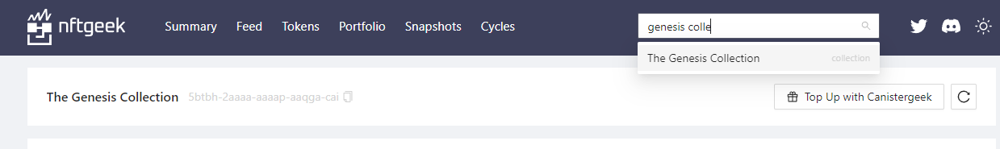
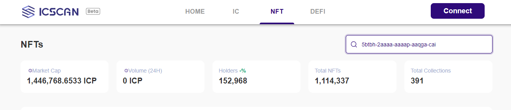
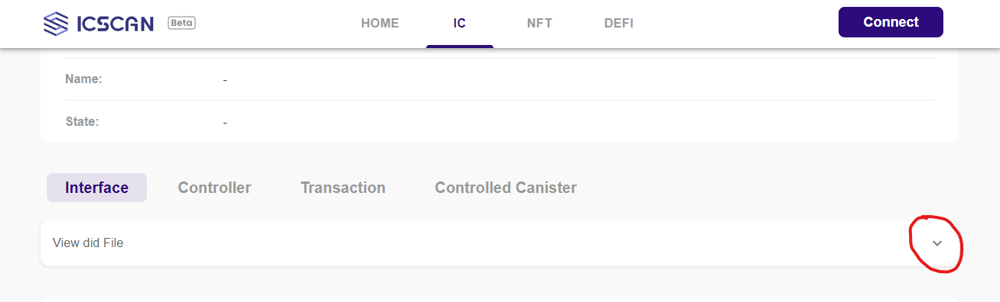
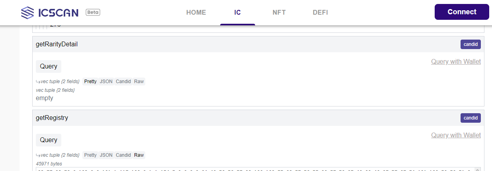

# Introduction:
Firstly, it's important to note that NFTs don't follow the same standard. Therefore, we'll need two things: knowing the IDLs of the specific NFT and identifying which functions of the canister are relevant. To address both aspects, we will use ICSscan.

## Step 1: Get the canister id .
Navigate to [NftGeek](https://t5t44-naaaa-aaaah-qcutq-cai.raw.ic0.app), search the specific collection of the nft that you want and save the canister id.

for example if I want "the genesis collection" I Would search: 

In my case the canister id of this collection is : 
```bash
5btbh-2aaaa-aaaap-aaqga-cai 
```

## Step 2: Get the idl file.

### A- Go to [IcScan](https://icscan.io) and search the canister Id from your collection.

### B-Once you search it scroll down and search the "View Did File".

### C-Select JavaScript and coppy the code.

### D- Add the code to a new idl file.
Create a new file and coppy the script
``` bash
src
└── frontend
    └── src
        └── utils
            └── idls
                ├── Users.js
                └── Genesis.js // my new file 
```

## Step 3: Add your Canister Id and the idl properties.


### A- Go to the[canisters file](../src/frontend/src/utils/canisters.js).
``` bash
src
└── frontend
    └── src
        └── utils
            └── canisters.js
```
### B- Link your idl file
Import your idl in like this
```js
import myIdl from "./idls/myCollection";
 ```
### C- Add your canister ID
Add the id in the "canisterIds" and create a new Object in "canisters" with the your id
### D- Add your idlFactory
Add "myIdl" like the value of a key called "idlFactory"
```js
import idlUsers from "./idls/Users";
import IdlGenesis from "./idls/Genesis";

export const canisters = {
  db_users: { canisterId: "mqblk-2aaaa-aaaam-ab64a-cai", idlFactory: idlUsers },// db_users
  genesis: { canisterId: "5btbh-2aaaa-aaaap-aaqga-cai", idlFactory: IdlGenesis }, // genesis collection

};

export const canisterIds = [
  "mqblk-2aaaa-aaaam-ab64a-cai", // db_users
  "5btbh-2aaaa-aaaap-aaqga-cai" // genesis collection
];
 ```

## Step 4 Get your functions.

I recommend using ICSscan to identify the functions within the IDLs that provide information about the NFTs owned by a principal. By scrolling down, you'll see all the functions of the canister. Typically, the canister will include the 'GetRegistry' function, which informs you about the existing NFTs and their owners, allowing you to filter as needed.



These functions will enable us to retrieve the NFTs owned by the principal. Once identified, implement these functions to populate our total array of NFTs, named "allNFT".

It's important to note that ICSscan will be instrumental in searching for and comprehending the relevant functions in the IDLs.

Additionally, within [useNft.js](../src/frontend/src/hook/useNfts.js), by leveraging the functions from each canister (the ID of each NFT collection) and the user's principal, you should be able to access all the NFTs from that collection owned by the user. Subsequently, these NFTs should be appended to the 'All' array in 'useNfts'.
```js
 const useNfts = () => {
  const [genesis] = useCanister("genesis", { mode: "anonymous" });

  const allNfts = async (isConnected, principal) => {
    console.log({ isConnected, principal });

    if (!isConnected || !principal) return [];
  
    const genesis = await getGenesisNFTs(principal);
    const all = [...genesis]; // add the genesis array to all
    return all;

  };
};
```

for example if I want to know if a principal has the genesis collection I would use :
```js
 const getGenesisNFTs = async (principal) => {

    try {
      const registry = await genesis.getRegistry();
      console.log({ registry });

      
      const tokensId = registry
        .filter(
          (a) =>
            a[1] ===
            principalToAccount(p(principal))
        )
        .map((a) => a[0]);
      console.log({ tokensId });

      const exts = await genesis.getTokensByIds(tokensId);
      console.log({ exts });

      const data = exts.map((arr) => ({
        token_id: arr[0],
        ...JSON.parse(String.fromCharCode(...arr[1]?.nonfungible?.metadata?.[0])),
      }));
      console.log({ data });

      return data?.length > 0
        ? data.map((nft) => ({
            image: nft.thumb,
            name: nft.name,
            description: nft.description,
            collection: "The Genesis Collection",
          }))
        : [];
    } catch (err) {
      console.log("get genesis nfts error:", err);
      return [];
    }
  };

  return { allNfts };
 ```
It is important that the NFT object is structured as follows:
 ```js
 const nft = {
    image: ,
    name: ,
    description: ,
    collection: ,
 }
 ```

 The function all nft will be called in the [App.jsx](../src/frontend/src/App.jsx) once the user is logged in.

#
## Coming soon, the template will feature token reading capabilities and the option to change the name in the database.
