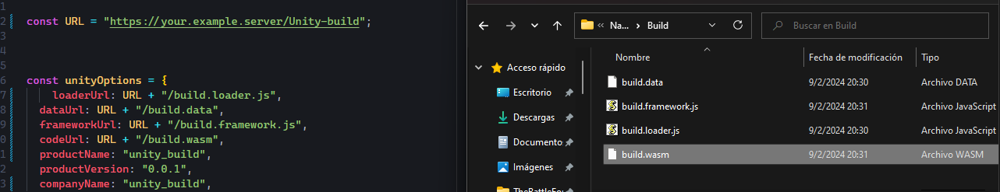
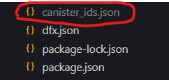

### Unity Build Configuration
This README provides the necessary steps to configure the Unity build in our application. Follow these steps to ensure the configuration is done correctly.

## Step 1: Locate the app.jsx File
The first step is to locate the app.jsx file in our project. This file is essential for configuring the application.

## Step 2: Configure the Unity Build URL
Within the app.jsx file, we will find the variables responsible for fetching the Unity build. These variables can be configured to fetch the build from either a server or an asset canister. It is important to ensure that the URL directory is correct.

## Step 3: Ensure File Names Match
It is essential that the file names of the Unity build match the location specified in the URL directory. This will ensure that the application can properly load the build.



for example in this case, you should have a folder in your domain called Unity-build and then the names of the files should be the same than your code.

## step 4: Create your canisters

A. First, you need to create your frontend canister because you require the canister ID before deployment:
 ```bash
 dfx canister create frontend --network ic 
  ```

This command will return something like this: "ecajd-kiaaa-aaaam-ab7jq-cai".Also this will generate a fil ".json" like this 

this file will be like this:
```json
{
  "frontend": {
    "ic": "ecajd-kiaaa-aaaam-ab7jq-cai"
  }
}

``` 
 Make sure to save this ID.

B. Insert your ID in the 

```js 
const client = createClient({
  canisters,
  providers: defaultProviders,
  globalProviderConfig: {
    whitelist: canisterIds,
    appName: "",
    // host: "https://ecajd-kiaaa-aaaam-ab7jq-cai.icp0.io/",this would be mine 
    host: "https://.icp0.io/",// put your id in the middle of https:// and .icp0
    dev: false,
    autoConnect: false,
  },
});
```
This will enable you to execute some POST methods on the Mainnet.